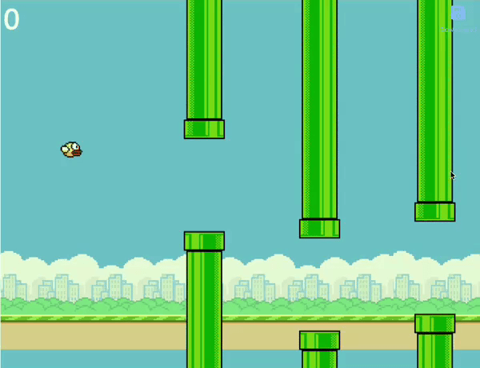

# Flappy Bird Game: Project Overview

Welcome to the Flappy Bird Game Project! 🐦🎮

## Introduction
In this project, we have created a simplified version of the popular Flappy Bird game using simple HTML, CSS, and JavaScript. Flappy Bird is a classic arcade game where the player controls a bird, guiding it through a series of pipes without hitting them. The objective is to navigate the bird through the pipes as far as possible to achieve the highest score.

## Features
- **Simple Controls**: Players can control the bird's altitude by pressing the spacebar, up arrow key, or "X" key.
- **Scoring System**: Players earn points for successfully passing through each set of pipes.
- **Collision Detection**: Accurate collision detection ensures that the game ends when the bird collides with the pipes or the ground.
- **Restart Mechanism**: After a collision, players can restart the game by pressing specific keys, enhancing the user experience and maintaining the game's flow.

## Technologies Used
- **HTML**: Used for structuring the game's layout and elements.
- **CSS**: Styled the game elements to create an appealing visual experience.
- **JavaScript**: Implemented game logic, including bird movement, pipe generation, scoring, collision detection, and restart functionality.

## How to Play
1. Open the game in your web browser.
2. Press the spacebar, up arrow key, or "X" key to control the bird's altitude.
3. Navigate the bird through the pipes by avoiding collisions.
4. Earn points for passing through each set of pipes.
5. If the bird collides with a pipe or the ground, press the specific keys to restart the game and continue playing.

## Game (GiF)

[!button target="blank" text="Live Demo"](https://ananya-184.github.io/0x08-2d-animation-project/)

## Conclusion
The Flappy Bird Game Project offers an engaging and nostalgic gaming experience, reminiscent of the classic arcade era. With its simple controls, scoring system, and restart mechanism, players can enjoy hours of addictive gameplay. Dive in and see how far you can guide the flappy bird through the obstacles!

Let the flapping begin! 🚀
